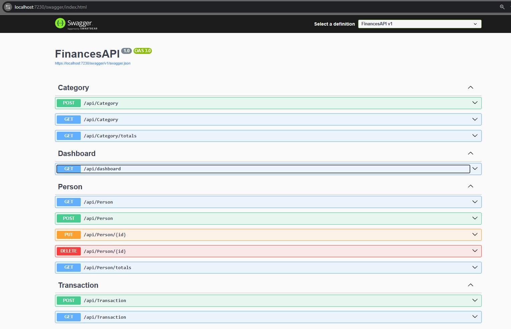
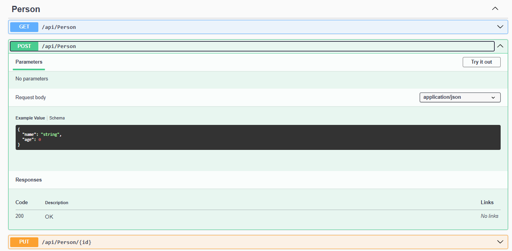
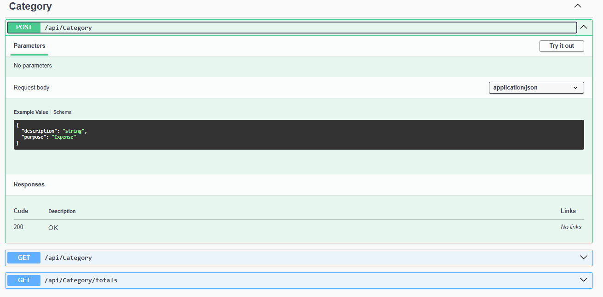
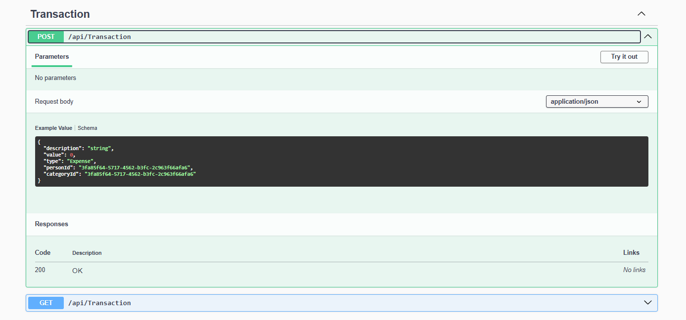
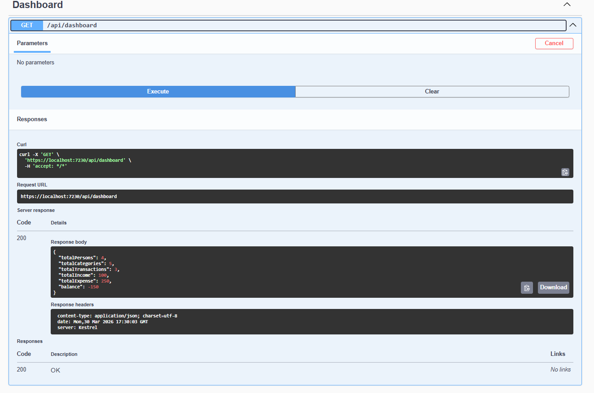

# FinancesAPI

API para controle de gastos residenciais, desenvolvida em .NET 8 com foco em organização de código, regras de negócio e separação em camadas.

## Tecnologias

- .NET 8 (Web API)
- Entity Framework Core
- SQLite
- Swagger

## Funcionalidades

### Pessoas
- Criar, listar, atualizar e deletar
- Ao remover uma pessoa, suas transações são excluídas automaticamente

### Categorias
- Criar e listar
- Finalidade: despesa, receita ou ambas

### Transações
- Criar e listar
- Associadas a uma pessoa e uma categoria

### Consultas
- Totais por pessoa (receitas, despesas e saldo)
- Totais por categoria (receitas, despesas e saldo)

## Regras de negócio

- Menores de idade (menos de 18 anos) não podem possuir receitas
- O valor da transação deve ser maior que zero
- A categoria deve ser compatível com o tipo da transação:
  - Categoria de despesa não aceita receita
  - Categoria de receita não aceita despesa
- Exclusão de pessoa remove suas transações (cascade delete)

## Arquitetura

O projeto está organizado em camadas:

- Controllers: recebem as requisições HTTP
- Services: concentram as regras de negócio
- Repositories: acesso a dados
- Domain: entidades e enums
- Infrastructure: configuração do banco e EF Core

## Como executar

bash
- git clone https://github.com/Nathan-Barbosa/FinancesAPI.git
- cd FinancesAPI
- dotnet restore
- dotnet ef database update
- dotnet run

## A API estará disponível em: http://localhost:5066/swagger

## Observações
- Os dados são persistidos em SQLite
- Os endpoints podem ser testados via Swagger
- O projeto utiliza DTOs para evitar exposição direta das entidades

## Prints do Swagger

## 📸 Prints do Swagger

### 🔎 Visão geral dos endpoints

### 👤 Criar Pessoa

### 🗂️ Criar Categoria

### 💰 Criar Transação

### 📊 Dashboard

